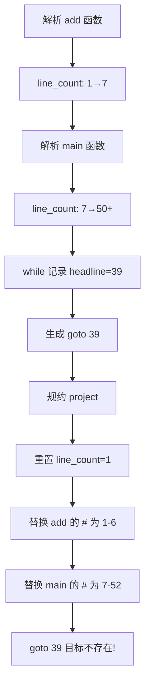

# 修复编译器行号跳转问题

## 问题分析

当前问题：在多函数场景下（如 `add` 函数 + `main` 函数），`line_count` 在解析时被用于计算跳转目标（如 `goto 39`），但在 `project` 规则中替换 `#` 时使用不同的行号序列，导致跳转目标不存在。




## 修复方案：标签系统

使用标签替代硬编码行号：

- 生成代码时使用 `goto @WHILE_1` 而不是 `goto 39`
- 在目标位置插入 `@WHILE_1:` 标签标记
- 替换 `#` 时记录标签对应的行号
- 最后将标签替换为实际行号

## 修改文件清单

### 1. [src/frontend/yacc.y](src/frontend/yacc.y)

**添加全局标签计数器**（第 24 行附近）：

```c
int label_id = 0;  // 全局标签计数器
```

**修改 if_identifier 规则**（第 573-580 行）：

- 生成唯一标签名存储到树节点

**修改 while_expression 规则**（第 612-624 行）：

- 生成唯一标签名存储到树节点

**修改 for_expression 规则**（第 595-609 行）：

- 生成唯一标签名存储到树节点

**修改 project 规则**（第 55-92 行）：

- 替换 `#` 为行号时，记录每个 `@LABEL:` 对应的行号
- 替换完成后，将 `goto @LABEL` 替换为实际行号

### 2. [src/utils/tree.h](src/utils/tree.h)

**更新函数声明**：

- 修改 `ifOpr`、`ifelseOpr`、`whileOpr`、`forOpr` 签名，接受标签参数

### 3. [src/utils/tree.c](src/utils/tree.c)

**修改 ifOpr 函数**（第 197-206 行）：

- 使用标签字符串替代数字
- 在跳转目标位置插入 `@LABEL:` 标记

**修改 ifelseOpr 函数**（第 208-219 行）：

- 使用标签字符串替代数字

**修改 whileOpr 函数**（第 221-231 行）：

- 使用标签字符串替代数字

**修改 forOpr 函数**（第 233-245 行）：

- 使用标签字符串替代数字

### 4. [src/utils/inner.c](src/utils/inner.c)

**添加标签处理函数**：

- `replaceLabels(char* code)`: 将 `@LABEL` 替换为实际行号

## 实施检查清单

1. 在 yacc.y 添加 `label_id` 全局变量
2. 修改 tree.h 更新函数声明（添加标签参数）
3. 修改 tree.c 的 ifOpr 函数使用标签
4. 修改 tree.c 的 ifelseOpr 函数使用标签
5. 修改 tree.c 的 whileOpr 函数使用标签
6. 修改 tree.c 的 forOpr 函数使用标签
7. 在 inner.c 添加 replaceLabels 函数
8. 修改 yacc.y 的 if_identifier 规则生成标签
9. 修改 yacc.y 的 while_expression 规则生成标签
10. 修改 yacc.y 的 for_expression 规则生成标签
11. 修改 yacc.y 的 project 规则调用标签替换
12. 在 WSL 中重新编译：`make clean && make`
13. 测试 test7.c 验证修复