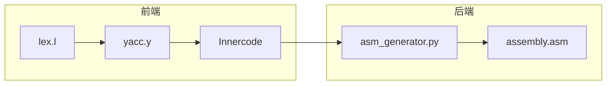

# Mini-C 编译器高级特性完整实现计划

## 当前状态分析

项目已有两套中间代码系统：

- **旧系统**：[src/frontend/yacc.y](src/frontend/yacc.y) 通过 `Tree->code` 生成字符串格式四元式
- **新系统**：[src/ir/ir_builder.c](src/ir/ir_builder.c) 生成结构化 IR（未被主程序使用）

汇编生成器 [scripts/asm_generator.py](scripts/asm_generator.py) 读取旧格式的 `Innercode` 文件。

## 实现架构



---

## 功能1: 修复浮点运算

**问题**：浮点输出显示错误值**修改文件**：

- [scripts/asm_generator.py](scripts/asm_generator.py)

**修改内容**：

1. 检查浮点常量的 IEEE 754 表示是否正确
2. 修复 `output_float` 的 printf 调用（确保 xmm0 正确传递 double 值）
3. 添加浮点数据段声明

---

## 功能2: 函数定义与调用

**中间代码格式**：

```javascript
FUNC_BEGIN func_name
param x
param y
...
FUNC_END func_name

arg value1
arg value2
result = call func_name
```

**修改文件**：

- [src/frontend/yacc.y](src/frontend/yacc.y) - 扩展函数定义规则生成中间代码
- [scripts/asm_generator.py](scripts/asm_generator.py) - 添加函数汇编生成

**汇编实现**（x86-64 System V ABI）：

- 参数传递：rdi, rsi, rdx, rcx, r8, r9（前6个整数参数）
- 浮点参数：xmm0-xmm7
- 返回值：rax（整数）或 xmm0（浮点）

---

## 功能3: 一维/二维数组

**中间代码格式**：

```javascript
; 数组声明
arr = alloc 40        ; 10个int，每个4字节

; 数组访问 arr[i]
t1 = i * 4            ; 偏移计算
t2 = arr + t1         ; 地址计算
t3 = load t2          ; 读取值

; 数组赋值 arr[i] = value
store value t2        ; 存储值
```


**修改文件**：

- [src/frontend/yacc.y](src/frontend/yacc.y) - 数组声明和访问的中间代码生成

- [src/utils/tree.c](src/utils/tree.c) - 添加数组操作辅助函数

- [scripts/asm_generator.py](scripts/asm_generator.py) - 添加数组汇编生成

**汇编实现**：

- 栈上分配数组空间

- 使用 `lea` 计算地址

- 使用 `mov [addr], value` 存储

---

## 功能4: 指针运算

**中间代码格式**：

```javascript
; 取地址 &x
t1 = addr x

; 解引用 *p
t2 = load p

; 指针赋值 *p = value
store value p
```


**修改文件**：

- [src/frontend/yacc.y](src/frontend/yacc.y) - 指针操作的中间代码生成

- [scripts/asm_generator.py](scripts/asm_generator.py) - 添加指针汇编生成

**汇编实现**：

- 取地址：`lea rax, [rbp-offset]`

- 解引用：`mov rax, [rax]`

- 间接存储：`mov [rax], value`

---

## 功能5: 结构体

**中间代码格式**：

```javascript
; 结构体声明
struct_var = alloc 12     ; 假设3个int成员

; 成员访问 s.member
t1 = struct_var + 4       ; 成员偏移
t2 = load t1

; 成员赋值 s.member = value
store value t1
```


**修改文件**：

- [src/frontend/yacc.y](src/frontend/yacc.y) - 结构体成员访问中间代码

- [src/utils/hashMap.c](src/utils/hashMap.c) - 存储结构体类型信息

- [scripts/asm_generator.py](scripts/asm_generator.py) - 结构体汇编生成

---

## 实现优先级

| 优先级 | 功能 | 预计工作量 | 依赖 |

|--------|------|------------|------|

| 1 | 修复浮点 | 1-2小时 | 无 |

| 2 | 函数调用 | 3-4小时 | 无 |

| 3 | 一维数组 | 3-4小时 | 无 |

| 4 | 指针 | 2-3小时 | 数组 |

| 5 | 结构体 | 3-4小时 | 指针 |---

## 测试代码示例

```c
// 函数定义和调用
int add(int a, int b) {
    return a + b;
}

void main() {
    int result = add(10, 20);
    output_int(result);  // 30
    
    // 数组
    int arr[5];
    arr[0] = 100;
    arr[1] = 200;
    output_int(arr[0]);  // 100
    
    // 指针
    int x = 42;
    int* p = &x;
    output_int(*p);  // 42
}
```


---

## 注意事项

1. 保持向后兼容：现有的简单程序必须继续工作

2. 中间代码格式：在现有格式基础上扩展，不破坏现有解析逻辑